<p align="center">
  <picture>
    <source media="(prefers-color-scheme: dark)" srcset="assets/brand/lockup-dark.svg">
    
  </picture>
</p>

<p align="center">
  <strong>Secure, long-range, off-grid autonomous flight drone platforms powered by edge compute.</strong><br>
  <sub>Holybro X500 V2 · Pixhawk 6X · Jetson Orin Nano · Heltec Wireless Stick V3 · LoRa C2</sub>
</p>

<p align="center">
  <a href="https://github.com/sarreola07/VENATOR/actions/workflows/tests.yml">
    
  </a>
  <a href="https://github.com/sarreola07/VENATOR/actions/workflows/build-gcs.yml">
    
  </a>
</p>

<p align="center">
  <a href="https://sarreola07.github.io/VENATOR/">
    <picture>
      <source media="(prefers-color-scheme: dark)" srcset="assets/brand/cta-dark.svg">
      
    </picture>
  </a>
</p>

<p align="center">
  <picture>
    <source media="(prefers-color-scheme: dark)" srcset="assets/brand/hero-dark.svg">
    
  </picture>
</p>

The ground station sends a command over LoRa, the Jetson runs it against the
flight controller, and the reply comes back the same way. No QGroundControl, no
GUI, no internet — a laptop, a radio and a drone.

## Current hardware setup

| Component | Details |
|---|---|
| Airframe | Holybro X500 V2, quadcopter, 500 mm wheelbase, 144x144 mm body plate, 610 g frame weight |
| Flight controller | Pixhawk 6X (FMUv6X, v2A baseboard) |
| Firmware | PX4 version TBD - confirm on hardware |
| GPS | Holybro M10 (fitted, getting a fix) |
| Motors | 4x Holybro 2216 KV920 |
| ESCs | 4x BLHeli S 20A (4S compatible) |
| Propellers | 1045 |
| Battery | 4S 3000-5000 mAh 20C+ with XT60 (not included in kit) |
| Telemetry radio | SiK Telemetry Radio V3 (915 MHz) — present but unused; shares band with LoRa C2 link |
| Companion computer | NVIDIA Jetson Orin Nano Developer Kit |
| OS | Ubuntu 24.04.4 LTS (L4T R39.2, kernel 6.8 tegra) |
| Connection | USB → `/dev/ttyACM0` (baud rate is ignored on USB CDC) |
| Ground station | None installed (this repo replaces QGC for basic checks) |

Other serial ports available on the Jetson if you later wire TELEM2 to the
40-pin header: `/dev/ttyTHS1` and `/dev/ttyTHS2` (UARTs, typically 57600 or
921600 baud — must match the `SER_TEL2_BAUD` PX4 parameter).

> Reinstalling the Jetson (e.g. moving to NVMe)? The camera environment and
> venvs live outside this repo — see [docs/REINSTALL.md](docs/REINSTALL.md) to
> rebuild everything from a fresh clone.

> Working on the LoRa link from two computers at once (laptop on one end, Jetson
> or a stand-in on the other)? See [docs/DEV_SETUP.md](docs/DEV_SETUP.md) for the
> bring-up order, and `radio/link_test.py` for a scripted two-ended link check.

## Missions (drone/missions.py)

Interactive bench-test program:

```bash
./venv/bin/python drone/missions.py
```

It first asks whether the propellers are removed, then shows a menu that **loops
until you press `q`** — after each mission it returns to the menu so you can run
another. Press `p` to re-declare the props state (to switch between motor tests
and flight without restarting). It offers:

| Mission | What it does | Requires |
|---|---|---|
| 1 | Spins each motor one at a time, 3 s each at 15% throttle | Props **OFF** |
| 2 | Spins all motors together for 3 s at 15% throttle | Props **OFF** |
| 3 | Arms, takes off to 3 ft (0.91 m), hovers, lands, disarms | Props **ON**, GPS position fix, extra `FLY` confirmation |
| 4 | Manual RC flight: switches to Stabilized, arms, then monitors while you fly with the transmitter | Props **ON**, RC link up, extra `FLY` confirmation |
| 5 | Camera tracking display — shows the OAK-D's live person X/Y/Z. No flight. | Tracker started with `drone/camera.sh` |
| 6 | LoRa remote — runs missions from LoRa commands (see table below) | LoRa module on `/dev/ttyUSB0` |

Safety interlocks: motor tests are locked out while props are on, and flight is
locked out while props are off. Ctrl-C sends a disarm in missions 1–3; in
mission 4 it only stops the monitor — the RC pilot keeps control and disarms
with the sticks (throttle low + yaw left).

### Camera + LoRa architecture

Two processes talk over a local UDP socket, which keeps the camera's DepthAI
environment separate from the flight code's venv:

```
OAK-D  --USB-->  drone/camera_publisher.py (depthai-env)  --UDP 127.0.0.1:5005-->  drone/missions.py (venv)
                                                    --HTTP :8080 (stream)-->  laptop browser (optional)
LoRa   --/dev/ttyUSB0 serial-->                                              drone/missions.py (pyserial)
Pixhawk--/dev/ttyACM0 MAVLink-->                                             drone/missions.py (pymavlink)
```

- **`drone/camera_publisher.py`** runs the OAK-D person detector headlessly (in
  `~/oak_drone_project/depthai-env`) and broadcasts the nearest person's
  `{x, y, z, conf}` in metres. It is started/stopped **on demand** via
  `drone/camera.sh` — never at boot. See [drone/README.md](drone/README.md).
- **Option 5** subscribes to that UDP stream and prints live coordinates — pure
  telemetry, never touches the flight controller. (Autonomous *follow-flight* is
  intentionally not wired up on this PX4 vehicle yet; see Notes.)
- **Option 6** turns LoRa packets (`{"msg": "N"}`) into missions, under the **same
  props interlock** you declare at startup:

  | LoRa `msg` | Action | Allowed when |
  |---|---|---|
  | `1` | sequential motor test | props **OFF** |
  | `2` | all-motor test | props **OFF** |
  | `3` | camera display (30 s) | always |
  | `4` | flight: arm / takeoff / land | props **ON** |

  Because a LoRa sender can't type the `FLY` prompt, command `4` flies with **no
  local confirmation** — it is still gated by props-ON and the Pixhawk's own
  pre-arm checks (which currently need a GPS fix). LoRa is **not** auto-started on
  boot; it only runs after you pick option 6.

The mission menu with props off, and the interlock refusing a flight mission
without props:


Mission 4 verifying the RC link before flight (aborted at the FLY prompt):


Notes for this vehicle (Pixhawk 6X, FMUv6X):

- Motor tests use `MAV_CMD_DO_MOTOR_TEST`; the safety switch must be pressed
  (solid LED) and a battery connected, or the FC rejects the command.
- Mission 3 uses PX4's AUTO.TAKEOFF/AUTO.LAND modes. PX4's own preflight and
  arm-time checks must pass before it will arm; when it refuses, the script
  prints the FC's exact reason ("FC says: ...").
- `SYS_AUTOSTART=6001` is for a DJI F550 hexarotor and is wrong for this
  quadcopter. It must be re-selected as a quadcopter airframe in QGroundControl
  and the value is to be confirmed.
- `CBRK_IO_SAFETY=22027` bypasses the safety switch. The 2.4.8 build had no
  switch wired; the 6X ships one, so this bypass should be re-decided rather
  than carried over.
- `COM_ARM_WO_GPS=1` allowed arming with no GPS because none was fitted. Now
  that the M10 is fitted and getting a fix, this should be reviewed.
- `COM_CPU_MAX=-1` was a workaround for an FMUv2 quirk where PX4 v1.13 did not
  run `load_mon`. The 6X is a different, far more capable board, so this
  workaround is likely unnecessary and should be re-tested rather than carried
  over.
