# Venator roadmap — laptop-commanded follow-me drone

End goal: command the drone from any laptop over LoRa, with **zero interaction on
the Jetson**, including a "fly to these coordinates" mission.

  

The sequence above is Mission 2 as designed, end to end. It is the target, not a
recording: the missions are built and bench-tested against mocks, and outdoor
flight is still pending.

## Status

| Phase | What | State |
|---|---|---|
| 0 | NVMe install + restore project (see [REINSTALL.md](REINSTALL.md)) | ✅ done |
| 1 | C2 protocol ([PROTOCOL.md](PROTOCOL.md), `radio/protocol.py`) | ✅ done |
| 2 | Portable laptop client + mock + CI to build `.exe`/`.app` | 🔵 in progress |
| 3 | Bidirectional Heltec firmware (half-duplex transceiver) | ✅ flashed + validated on real radios; OLED status on both sticks |
| 4 | Jetson C2 server + systemd boot service (zero-touch) | ✅ working over real LoRa (motor test); boot service + rich menu done |
| 5 | GPS + waypoint flight | 🔵 upload + flight trigger + two-step arm + link-loss RTL built & bench-tested; real outdoor flight pending a fix |
| — | Mission 1: hover + detect people + land | 🔵 built & bench-tested (mock); hover 2 m on GPS, person detection over LoRa; real flight outdoors, true 3 ft with lidar |
| — | Mission 2: follow the person until LoRa STOP | 🔵 built & bench-tested (mock); OFFBOARD velocity follow (keep 3 m), STOP->land, camera-loss->hover, link-loss->RTL |
| 6 | Polish: auto-launch agents, saved "places", browser GUI, OFFBOARD follow | ⬜ |

## Phase details

- **1 — Protocol** *(done):* versioned, newline-JSON messages; handshake, menu,
  run, waypoint upload, ACK/retransmit. Shared by client and Jetson server.
- **2 — Client** *(in progress):* `ground/gcs_client.py` auto-detects the Heltec
  (CP210x VID), handshakes, renders the Jetson's menu, uploads waypoints. Runs
  today with `--mock` (no hardware). The GitHub Actions workflow builds
  `VenatorGCS.exe` and `.app` — download from the run's Artifacts.
- **3 — Firmware:** merge the two working sketches into one half-duplex
  transceiver (transparent line bridge, same 915 MHz/SF7/syncword). Flash both
  sticks.
- **4 — Jetson server** *(server done):* `drone/c2_server.py` owns the LoRa
  serial and the Pixhawk; serves the menu, runs missions (reusing `drone/missions.py`),
  streams ACK/DONE. Defaults to a **mock FC** and **props OFF** (safe); `--real`
  connects the Pixhawk, `--props-on` enables flight. Tested end-to-end against the
  real client over a loopback — props + GPS gates verified. `deploy/systemd/venator-c2.service`
  is the zero-touch boot unit (enable deliberately). The two-step arm confirm
  (`CONFIRM` gates every flight), the link-loss failsafe (`LINK_LOSS_S = 4.0` →
  RTL) and mid-mission `ABORT` are all in place: the mission loops poll the link
  while flying instead of blocking, so aborts and heartbeats are handled promptly.
- **5 — Waypoint flight:** fit a GPS (M8N → Pixhawk GPS port; `EKF2_AID_MASK=1`
  already set). Upload via `MISSION_ITEM_INT` → `AUTO.MISSION`, altitude cap +
  RTL-last, bench-validate acceptance, then fly outdoors.
- **6 — Polish:** zero-click launch agents on your own Win/Mac, a saved places
  library, a browser GUI, and the OFFBOARD-mode camera-follow port.

## Open decisions (needed by Phase 4/5)

1. Link-loss during flight: RTL or land-in-place? (default: RTL)
2. Geofence radius + altitude cap.
3. Coordinates: free-typed, saved "places", or both?
4. Client UI: CLI now, browser GUI later.
5. **Message addressing** — see below. Blocks putting a third radio on the link.

## A third radio: what it takes

LoRa is a broadcast medium, so a third stick on 915 MHz / SF7 / syncword 0x12
hears every packet with no firmware change at all. The radio layer is free. What
is not free is that nothing in the protocol says who a message is *from* or *to*.
Two consequences, the second of which matters before the drone flies.

**Delivery confirmation stops being honest.** `radio/phone_relay.py` ACKs every LOG it
hears, unconditionally, before its own dedup check. With two peers instead of
one, both hear a message at the same instant and both transmit an ACK
immediately -- those two ACKs collide on air and cancel each other out. The
`MIN_SEND_GAP_S` pacing in `radio.link_test.Link` is per-node and knows nothing about
what other nodes are doing. The likely result is that both peers display the
message correctly while the sender shows "not confirmed", i.e. the confirmation
gets less trustworthy as the network grows. And an ACK that does survive only
proves *someone* received it: the second ACK for the same id hits
`pending.pop(...) -> None` and is silently discarded.

Fix shape, roughly 30 lines: carry a `from` (node name) on LOG and ACK; have the
sender wait for ACKs from N-1 distinct peers before reporting delivered, showing
partial state ("1 of 2") rather than a bare tick; and give each node a
deterministic ACK delay derived from its name so the replies do not overlap.

**Command authority is not divisible today.** `drone/c2_server.py` keeps a
single server-level `self._pending` -- it is not per-client. RUN sets it and
CONFIRM consumes it, with no record of which station sent either. On a
broadcast channel with three radios and no sender identity, one station's RUN
can be completed by a *different* station's CONFIRM, and neither operator would
see that the two halves came from different people. The two-step arm gate exists
precisely so nobody launches a hexacopter by accident, and with a third radio
present it quietly stops being a two-step gate.

So: chat is the safe place to get addressing right. Add `from` before a third
radio goes anywhere near the flight link, and make the arm gate remember which
station armed it.
